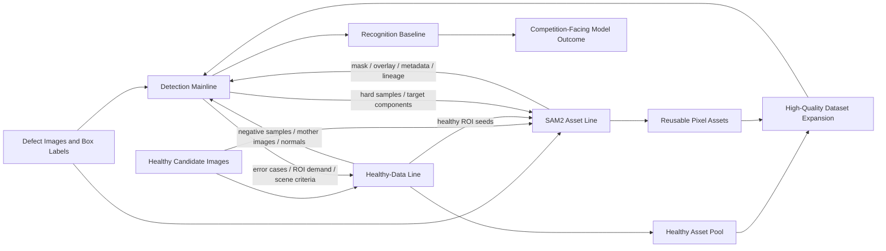

# Bolt Three-Line Architecture Design

## Goal

Define a single project mainline for `挂点金具螺栓缺失` that stays aligned with the competition's real evaluation target while keeping two support lines in parallel:

- the detection mainline
- the healthy-data line
- the SAM2 asset line

The design must explain why each line exists, what each line produces, how they intersect, and which actions have the highest immediate payoff.

## Scope

- Keep `bolt/` as the only production-oriented mainline area.
- Treat `demo/` only as a secondary smoke path.
- Optimize for competition-relevant outputs first: high-quality dataset assets and a usable defect-recognition pipeline.
- Use healthy data and SAM2 assets as support systems, not as replacement mainlines.
- Avoid assuming that full image generation is the first milestone.

## Constraints

- Current execution focus is only `挂点金具螺栓缺失`.
- Official supervision is rectangle-box annotation, not mask annotation.
- The current defect asset pool is small, around one hundred missing-bolt images with annotations.
- Healthy images are currently scarce.
- Private datasets and private docs must never leak into git.

## Core Decision

The project should have one mainline and two support lines:

- `Detection` is the mainline because the competition ultimately evaluates defect-recognition capability and because the official supervision format already supports it directly.
- `Healthy Data` is a support line because it provides normal-state priors, negative samples, and future generation mother images.
- `SAM2 Assets` is a support line because it turns raw images into reusable pixel-level local assets for editing, review, and future data expansion.

This means the project should not be framed as "generate first, then see what happens." It should be framed as:

`high-quality bolt dataset -> bolt-missing recognition -> asset expansion -> generation feedback`

## Architecture

### Detection mainline

Mission:
Build the stable recognition path for missing-bolt defects using the official box-based supervision regime.

Why it is the mainline:

- It is the most direct path to the competition's measurable model outcome.
- It matches the current annotation format.
- It can start immediately with existing defect images.
- It provides the strongest early feedback loop about whether the dataset is actually useful.

What it should produce:

- cleaned train/val/test splits
- normalized box annotations
- baseline detector checkpoints
- validation metrics
- false-positive and false-negative review sets
- inference and packaging scripts

What it needs:

- official or cleaned defect annotations
- later, selected healthy images as negatives or contextual normals
- later, SAM2-derived local assets for ROI studies and controlled augmentation

### Healthy-data line

Mission:
Build the normal-state asset pool that explains what an intact connection looks like.

Why it matters:

- missing-bolt is structurally defined by absence, not by a standalone object texture
- healthy images provide negative samples and reduce background overfitting
- healthy images become mother images for later image editing and defect injection
- healthy images help define what should not be labeled as defective

What it should produce:

- healthy candidate image pool
- screening rules for visibility, viewpoint, and scene relevance
- accepted healthy subsets
- normal ROI crops and metadata
- provenance records for external sources

What it needs:

- scene and component criteria from the detection line
- target ROI definitions from the SAM2 line

### SAM2 asset line

Mission:
Convert key local structures around bolts and connectors into reusable pixel-level assets.

Why it matters:

- official boxes are enough for detector training, but not enough for precise local editing
- pixel-level assets make later synthetic data generation more controllable
- masks and overlays support better review, lineage tracking, and reuse
- local assets help bridge from "images" to "components"

What it should produce:

- binary masks
- `core_mask` for tight visible defect evidence
- `edit_mask` for a slightly expanded local editing region
- review overlays
- per-asset metadata
- lineage records from source image to derived asset
- status flags such as draft, reviewed, approved, rejected

What it needs:

- seed images from defect or healthy pools
- ROI prompts or box guidance from the dataset and detection lines

## Engineering Graph

## Line Intersections

### Detection -> Healthy data

The detection line tells the healthy-data line what a useful normal image actually is. It defines:

- which viewpoints are usable
- which connector regions matter
- which negatives are confusing enough to matter
- which false positives must be covered by more normal data

### Healthy data -> Detection

The healthy-data line improves the detector by supplying:

- normal-state context
- hard negatives
- later, augmentation mother images

### Detection -> SAM2

The detection line tells the SAM2 line where the high-value local structures are:

- bolt heads
- nuts
- connector neighborhoods
- failure-prone ROIs

### SAM2 -> Detection

The SAM2 line improves the detector indirectly by supplying:

- more structured ROI analysis
- future controlled augmentation material
- review overlays for data auditing

### Healthy data -> SAM2

Healthy images are the best raw material for clean structural assets because they preserve intact geometry.

### SAM2 -> Healthy data

SAM2 outputs can be used to build organized healthy ROI libraries instead of storing only full-frame healthy photos.

## Technology Recommendations

### Detection now

Use a pragmatic detector baseline first. The immediate goal is not a perfect research system but a repeatable benchmark.

Recommended direction:

- keep box annotations as the canonical supervision source
- start with a standard single-class detector baseline such as a light YOLO family model
- favor transfer learning over architecture novelty
- use tile or patch-aware training/inference when the target is too small relative to the full image
- prioritize split hygiene, label quality, and review loops before architecture complexity

### Healthy-data now

Do not try to "collect all healthy images." Build a screened candidate pool.

Recommended direction:

- prioritize same-domain transmission inspection imagery
- keep source provenance
- define a strict acceptance rule: visible bolt-related structure, useful viewpoint, no obvious defect, not overly occluded
- store accepted samples separately from raw candidates

### SAM2 now

Do not try to replace annotation with SAM2. Use SAM2 as a derived-asset tool.

Recommended direction:

- use existing boxes as the canonical prompts
- follow `box -> padded ROI -> SAM2 -> optional click correction -> human QA`
- standardize output schema early
- separate `core_mask` and `edit_mask` semantics from the first pilot batch
- review small batches manually before scaling

## Highest-ROI Actions

### Highest ROI overall

1. make the detection dataset clean and training-ready
2. establish a first stable recognition baseline
3. start a screened healthy candidate pool
4. define the SAM2 asset contract and run a tiny reviewed pilot batch

### Why these actions win first

- they align directly with the competition's scoring reality
- they reduce project uncertainty fastest
- they avoid overcommitting to full generation before support assets exist
- they create reusable outputs for every later stage

## What Not To Do

- do not make generation the mainline before the recognition loop is stable
- do not treat any image containing bolts as valid healthy data
- do not use SAM2 outputs as the canonical annotation source for the competition dataset
- do not mix private raw assets into tracked git paths
- do not overfit the project around one visually pleasing demo path

## Immediate Build Order

1. Formalize the detection-ready dataset structure under `bolt/dataset/`
2. Run and evaluate the first recognition baseline under `bolt/detect/`
3. Build the healthy candidate screening path under `bolt/dataset/` private asset areas
4. Define and pilot the SAM2 asset schema under `bolt/mask/`
5. Use findings from the detector to tighten healthy-data collection and SAM2 targeting

## Success Criteria

The design is successful when:

- the repository has one clear mainline rather than three competing priorities
- each parallel line has a concrete purpose and output contract
- the team can explain why healthy data exists and why SAM2 exists without hand-waving
- the next implementation tasks can be assigned independently but still converge on the same dataset and model outcome
